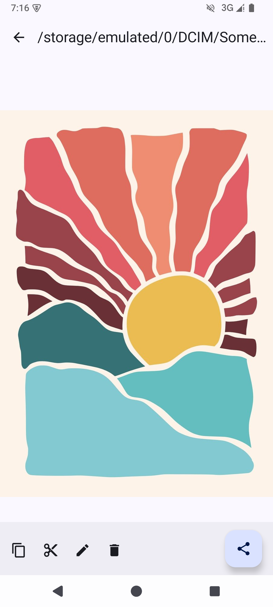
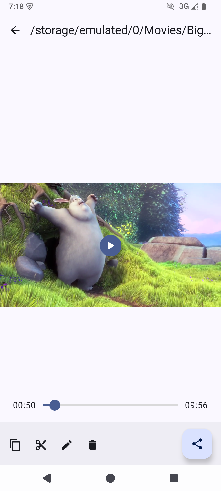
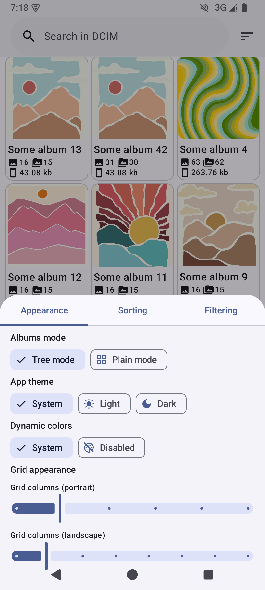
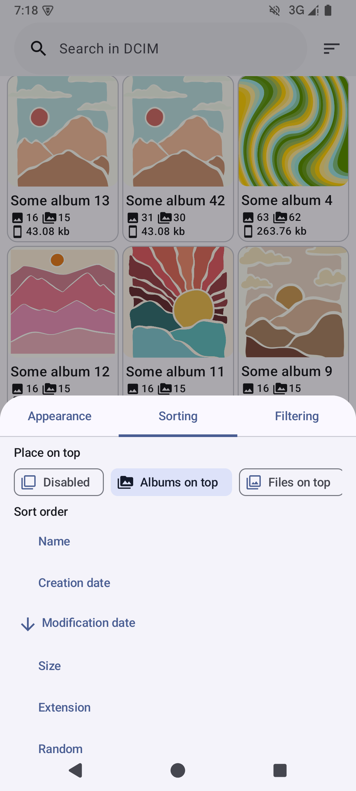
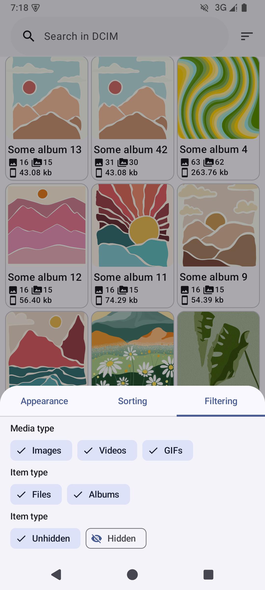

  
  <h1>Material Tree Gallery</h1>

Material 3 gallery app with nested albums support

# Features:

- Tree view: file manager-like navigation for large galleries organized with subdirectories.
  No more huge flat list with hundreds of albums on one screen! Find that meme with just a few
  taps!

  https://github.com/user-attachments/assets/5ec94d16-e128-48cd-98d3-969f073e8746

- Play GIFs as videos with pause and rewind support
- Modern Android design based on Material 3
- Dynamic color scheme support

# Screenshots:

  
  
  
  
  

